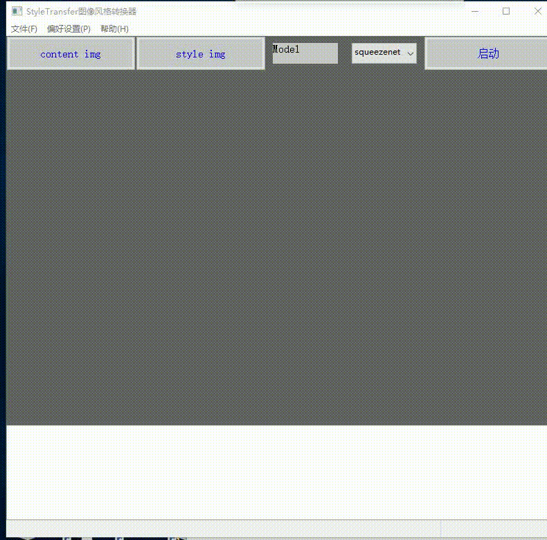

# StyleTransferGui
基于pytorch实现的、带GUI的图像风格迁移程序.

效果如下：

# Requirements

* Numpy
* wxPython
* pytorch
* torchvision
* PIL

# Usage:
```
$ python StyleTransferGui.py
```

button:
content img:选择内容图片
style img:选择风格图片
Start:启动风格转换程序

Model Choice:选择模型

Preferences->hyper parameter:设置训练超参数
